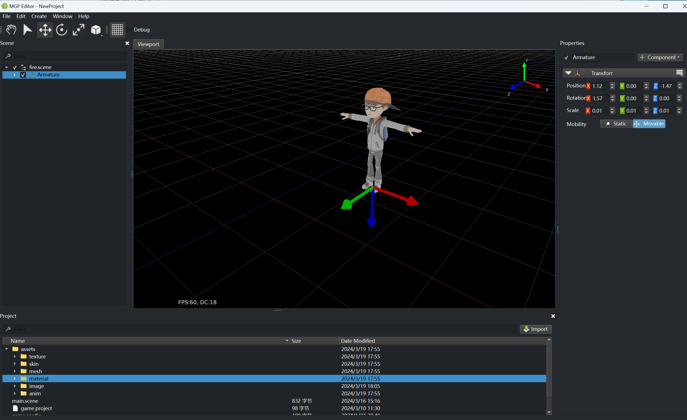
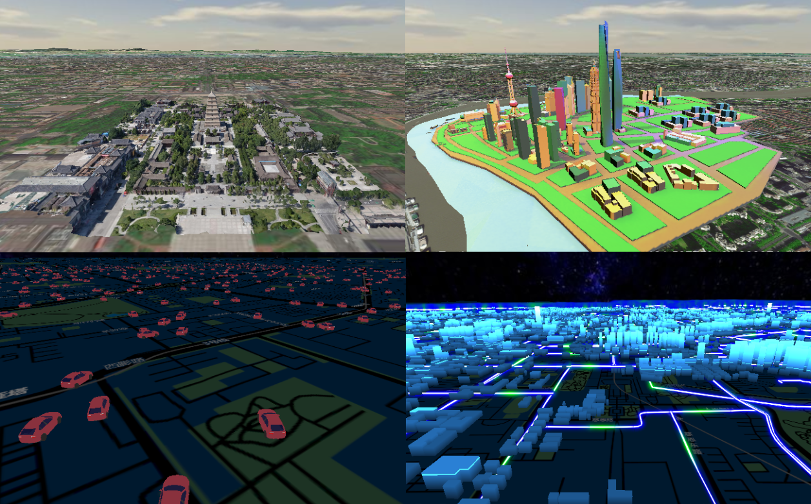
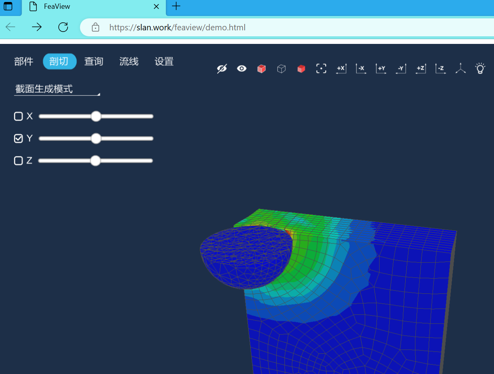

## MGP

MGP is a lightweight 3D game engine.

#### Features

- Rendering: OpenGL ES rendering backends with PBR, CSM
- PostEffect: SSAO, bloom, FXAA
- Assets: Importing GLTF
- UI: Build-in Declarative UI system
- Text: Dynamic load TTF fonts with unicode supporting
- Animation: Animation system with skeletal character animation
- Terrain: Height map based terrains with LOD
- Physics: Powered by Bullet
- Audio: 3D audio system with WAV and OGG support
- Lua like script (unmaintained)

## Doc
[Learn More](doc/index.md)

## Screenshot

