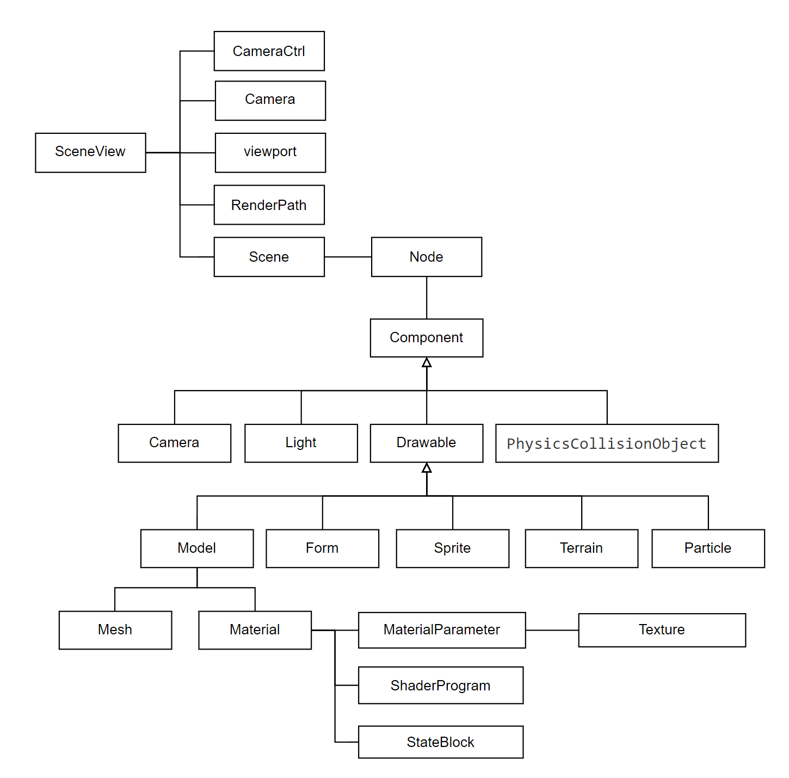
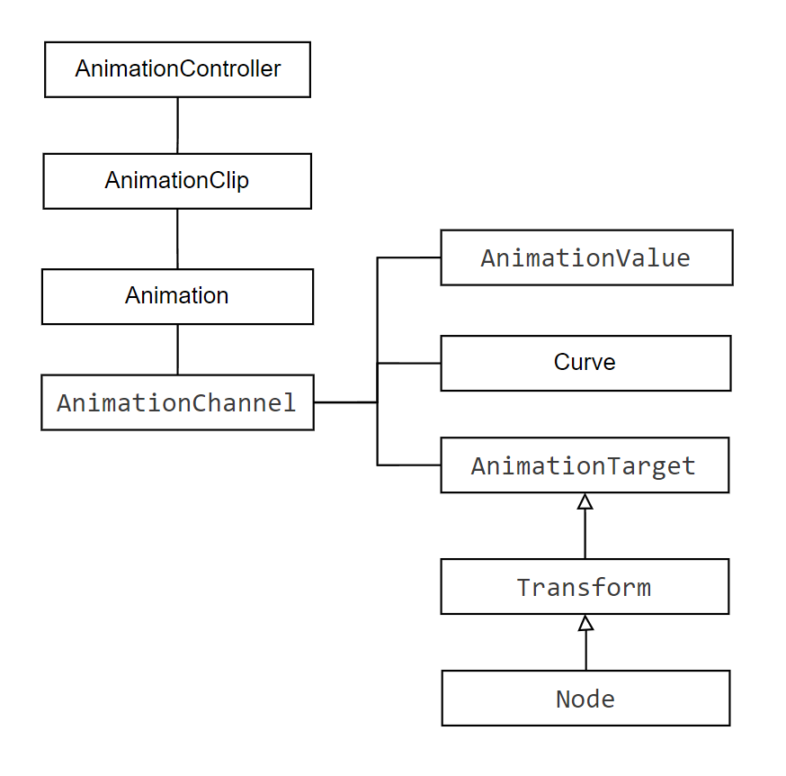

## 整体结构

mgpCore模块包括基础库、场景定义等。

mgpModules模块包括渲染、GUI、声音、物理等功能。除渲染外，很多都是可选的功能。

mgpPro模块包括网络、定制的图形绘制等功能，暂时没有开源。

再往上的游戏编辑器、FastEarth地图引擎等都是独立的项目，依赖mgp。

## 第三方库
尽管极力避免使用第三方库，但仍然有很多。

- glfw：提供窗口系统
- stb_image: 提供图片解码
- freetype：提供文字渲染
- Bullet：物理引擎
- miniaudio：声音库
- draco：压缩库（可选）
- jsonc：json库
- wase: GUI库

通过websemmbly编译到web平台时，几乎不依赖第三方库，所有功能都优先用浏览器提供的。

## 场景组成

Scene内是Node组成的树状结构。空间变换矩阵信息存储在Node中。每个Node包含多个Component，Component有多种实现。

Drawable表示可渲染的对象。其中Model包含Mesh和Material，分别表示几何和渲染样式。

## 动画系统

动画的依赖关系比较别扭，所以单独记录一下。

动画里面AnimationController负责多个动画的运行和更新。AnimationClip表示动画的片段，负责记录动画的执行状态。AnimationClip有start和stop方法负责动画的执行和停止。

Animation代表一个动画，是多个AnimationChannel的组合。Animation有一个默认的AnimationClip，可以创建新的AnimationClip。

但AnimationChannel反过来持有Animation的所有权，这个地方有些怪异。AnimationChannel包含一个Curve对象来存储实际的关键帧数据。

AnimationTarget是动画的目标对象，其他想动的对象继承自它。AnimationTarget引用AnimationChannel，而不是Animation。

## 渲染流程

渲染流程在RenderPath内执行，RenderPath包含多个RenderStage。RenderStage是一组渲染过程。前向渲染和延迟渲染是RenderStage的不同组合来实现的。

通过Renderer接口提供图形功能的封装，不直接依赖OpenGL，方便后期切换到其他图形API。

